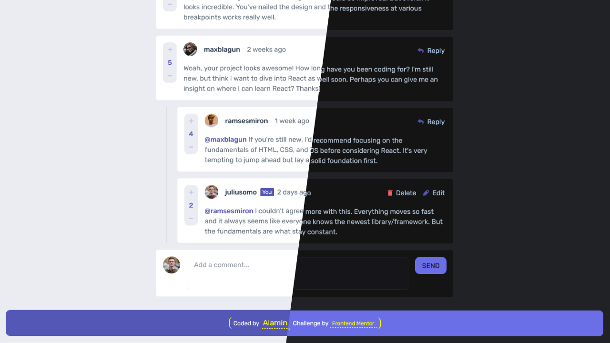

<h1 align="center">Interactive comments section</h1>
<div align="center">

Challenge from [Frontend Mentor](https://www.frontendmentor.io/challenges)

<h2>

[🚀Live Site](https://interactive-comments-section-codepapa360.vercel.app/)
||
[💡Frontend Mentor]()

</h2>
</div>

<!-- Badges -->
<div align="center">


<!-- Liceensee -->


</div>

<p align="center">
This is a web application that showcases an interactive comments section. Users can add new comments, reply to existing comments, edit their own comments, and vote on comments. The project follows the <code>Model-View-Controller (MVC)</code> architectural pattern to separate data, presentation, and user interaction. Additionally, the <code>Publisher-Subscriber</code> pattern is utilized for event handling, enhancing the modularity and maintainability of the codebase.
</p>

<!-- Screenshot -->
<a align="center" href="https://interactive-comments-section-codepapa360.vercel.app/">



</a>

## Technologies Used

- Vanilla JavaScript: The core language used for application logic and event handling.
- SASS: Used for styling and layout.
- HTML

## Project Structure

The project follows the MVC pattern to organize the code into three main components:

1. **Model (model.js):**

   - Handles data management and storage.
   - Provides methods for storing, retrieving, and updating comments.
   - Implements voting functionality for comments.
   - Manages the current user data and vote history.

```javascript
export const storeComment = async function (repliedToId, comment, parentId) {
  // ... code for storing a new comment or reply ...
};

export const deleteComment = function (parentId, mainId) {
  // ... code for deleting a comment or reply ...
};

// ... other model functions ...
```

2. **View (commentView.js, deleteModalView.js, editView.js, newCommentView.js, replyView.js, scoreView.js):**

   - Responsible for the presentation and rendering of data to the DOM.
   - Utilizes the generated HTML markup templates to display comments and other elements.
   - Implements methods to render main comments, replied comments, edit fields, delete modals, and reply fields.

```javascript
class CommentView {
  renderMainComment(data) {
    // ... code for rendering the main comment to the DOM ...
  }

  renderRepliedComment(data) {
    // ... code for rendering a replied comment to the DOM ...
  }

  // ... other rendering methods ...
}
```

3. **Controller (controller.js):**
   - Acts as the middleman between the Model and View components.
   - Implements event listeners using the `Publisher-Subscriber` pattern to handle user interactions.
   - Connects user actions to corresponding Model methods for data manipulation.
   - Utilizes View methods to display updated data to the user.

```javascript
const controlNewComment = async function () {
  // ... code for handling the addition of a new comment ...
};

const controlReplyComment = async function (repliedToId, comment, parentId) {
  // ... code for handling the addition of a reply to a comment ...
};

// ... other control functions ...
```

### Publisher-Subscriber (Pub-Sub) pattern:

The Pub-Sub pattern is a design pattern where multiple components `(subscribers)` subscribe to `events` published by a central component `(publisher)`. Subscribers are notified whenever a relevant `event` occurs.

```javascript
// Example from controller.js
const init = function () {
  editView.addHandlerEditBtn(controlEditComment);
  scoreView.addHandlerVoting(controlVoting);
  replyView.addHandlerReplyBtn(controlReplyComment);
};

init();
```

## Key Features

Users should be able to:

- Create, Read, Update, and Delete comments and replies.
- Upvote and downvote comments.
- **Bonus**: Utilized `localStorage` to save the current state in the browser and persist when the browser is refreshed.
- **Bonus**: Instead of using the `createdAt` strings from the `data.json` file, I have used timestamps and dynamically track the time since the comment or reply was posted.
- **Bonus**: Dark mode toggler.

## What I Learned:

The MVC pattern helped me organize my code and separate different parts of the application. It made it easier to manage data, handle user interactions, and update the user interface without making everything messy. The Model represents the data and project logic, the View is responsible for the user interface, and the Controller acts as the middleman between the Model and View.

On the other hand, the Pub-Sub method provided a way for different parts of the application to communicate with each other without knowing each other's details. It's like having a bunch of people (subscribers) listening for updates from a central place (publisher). When something changes, the publisher notifies all the subscribers, and they can react accordingly.

By using these patterns, I was able to create a more organized and maintainable application. It also helped me handle user interactions and update the comments section dynamically without reloading the page. I learned how to manage data efficiently, display it on the screen, and handle user interactions smoothly.

This project built upon my previous experience with the [Forkify](https://github.com/CodePapa360/Forkify-Recipe-App) app, where I first encountered these patterns. Through practice and application, I gained more confidence in using these patterns effectively and understanding their benefits in real-world projects.

Overall, it was a great learning experience, and I'm excited to use these skills in future projects to create even better and more user-friendly web applications.

## Author

<b>👤 Alamin</b>

- Twitter - [@CodePapa360](https://www.twitter.com/CodePapa360)
- LinkedIn - [@CodePapa360](https://www.linkedin.com/in/codepapa360)
- Frontend Mentor - [@CodePapa360](https://www.frontendmentor.io/profile/CodePapa360)
- Github: [@CodePapa360](https://github.com/codepapa360)

Feel free to contact me with any questions or feedback!

## Acknowledgments

This project was inspired by the "Interactive Comments Section" challenge from Frontend Mentor. Special thanks to Frontend Mentor for providing the design and specifications for this project.

## License

This project is licensed under the [MIT](https://github.com/CodePapa360/Interactive-comments-section/blob/main/LICENSE.md) License - see the LICENSE file for details.
