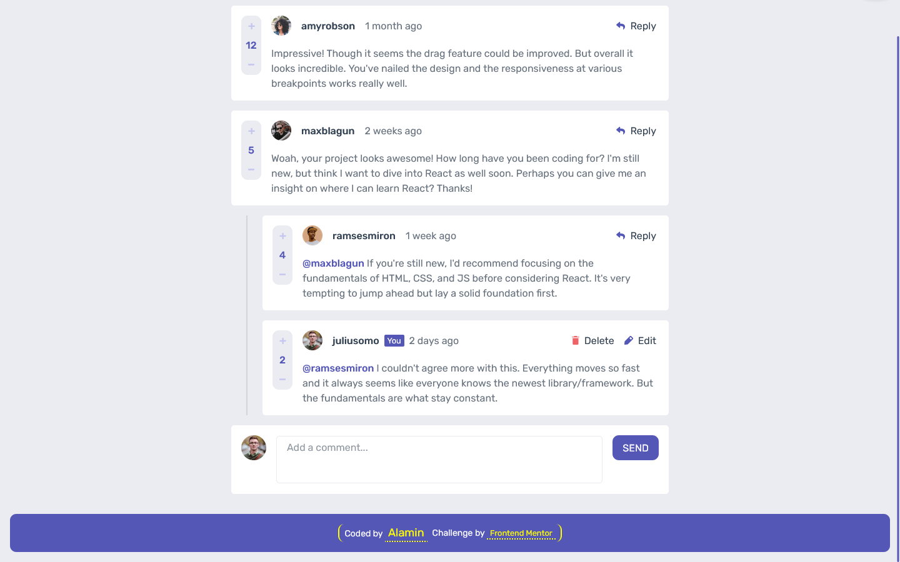

<h1 align="center">Interactive comments section</h1>
<div align="center">

Challenge from [Frontend Mentor](https://www.frontendmentor.io/challenges)

</div>

<!-- Badges -->
<div align="center">

<!-- Live -->
<a href="https://interactive-comments-section-codepapa360.vercel.app/">
    
</a>

<!-- Frontend Mentor -->
<a href="#">
    
</a>
</div>

<div align="center">
<!-- Status -->

<!--  -->


<!-- Liceensee -->

</div>

<hr>

<div align="center">

<p>

</p>

<!-- Screenshot -->
<a align="center" href="https://interactive-comments-section-codepapa360.vercel.app/">



</a>

</div>

## The challenge

Users should be able to:

- View the optimal layout for the app depending on their device's screen size
- See hover states for all interactive elements on the page
- Create, Read, Update, and Delete comments and replies
- Upvote and downvote comments
- **Bonus**: If you're building a purely front-end project, use `localStorage` to save the current state in the browser that persists when the browser is refreshed.
- **Bonus**: Instead of using the `createdAt` strings from the `data.json` file, try using timestamps and dynamically track the time since the comment or reply was posted.

## Built with

- Semantic HTML5 markup
- Mobile-first workflow
- CSS custom properties
- CSS Grid
- JavaScript
- NPM
- [Webpack - a module bundler](https://webpack.js.org/)

## What I Learned

## Installation

- Clone this repo:

```sh
git clone https://github.com/CodePapa360/Interactive-comments-section.git
```

- Install dependencies:

```sh
npm install
```

- Build command:

```sh
npm run build
```

- Live server:

```sh
npm start
```

## Author

<b>👤 Alamin</b>

- Twitter - [@CodePapa360](https://www.twitter.com/CodePapa360)
- LinkedIn - [@CodePapa360](https://www.linkedin.com/in/codepapa360)
- Frontend Mentor - [@CodePapa360](https://www.frontendmentor.io/profile/CodePapa360)
- Github: [@CodePapa360](https://github.com/codepapa360)

Feel free to contact me with any questions or feedback!

## Show your support

Give a ⭐️ if you liked this project!

## Acknowledgments

Special thanks to Frontend Mentor for providing such an amazing platform to practice and improve my frontend skills.

## License

This project is licensed under the [MIT](https://github.com/CodePapa360/Interactive-comments-section/blob/main/LICENSE.md) license, which means you can use, modify, and distribute the code as you wish. If you have any questions or feedback, feel free to reach out. Thank you for considering my code!
